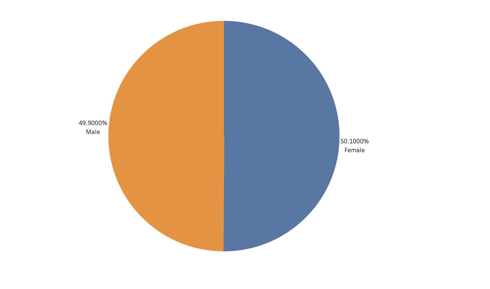
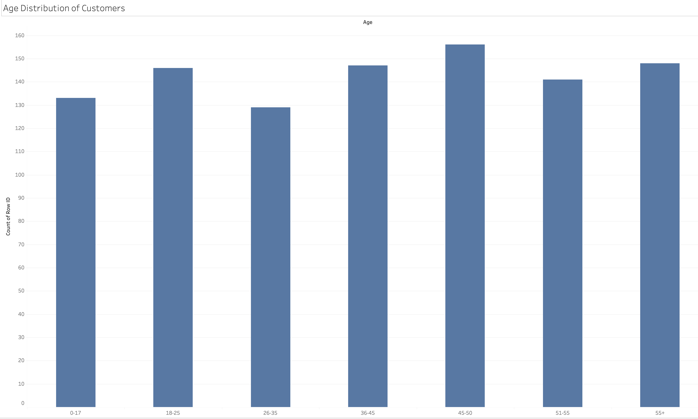
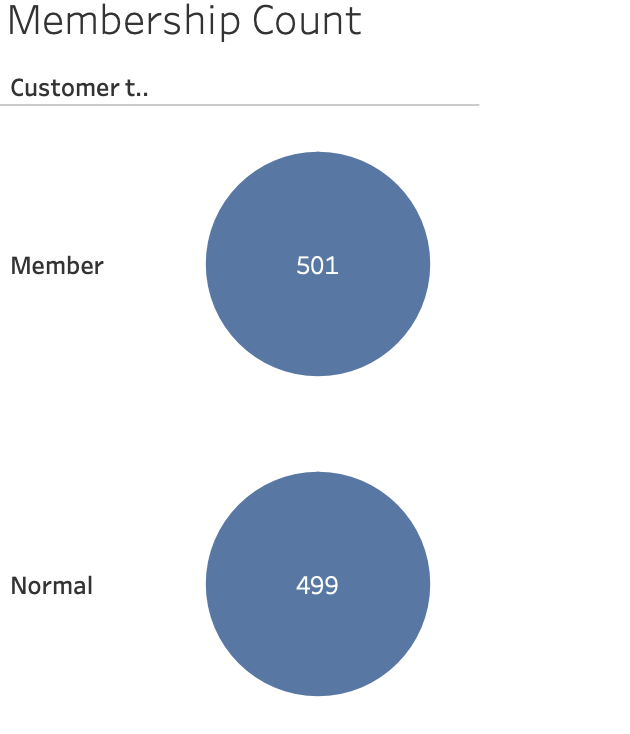
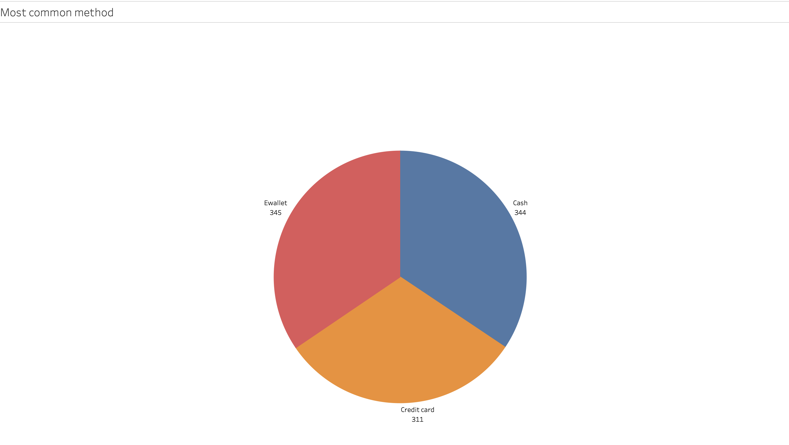
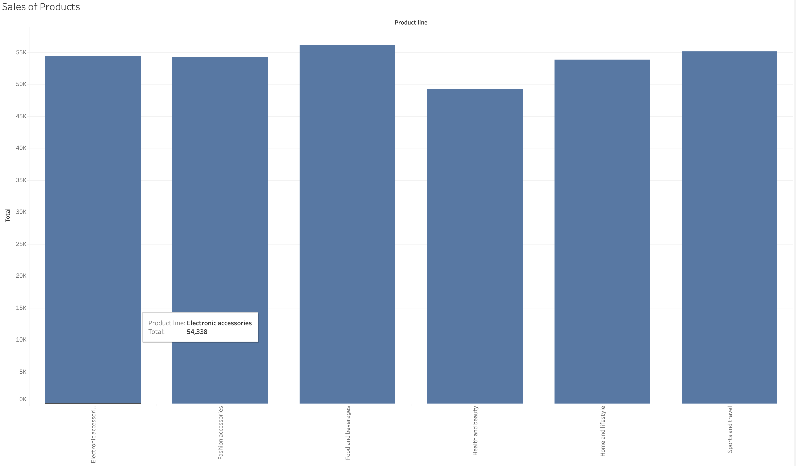
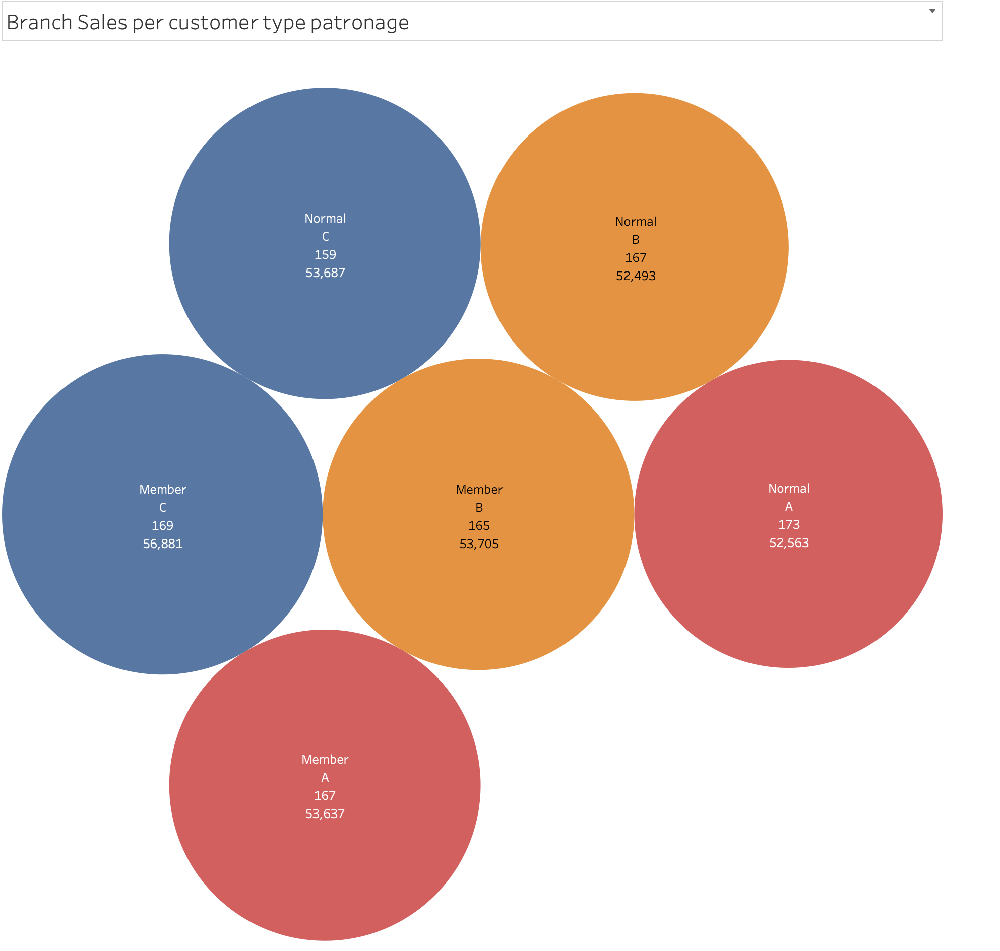
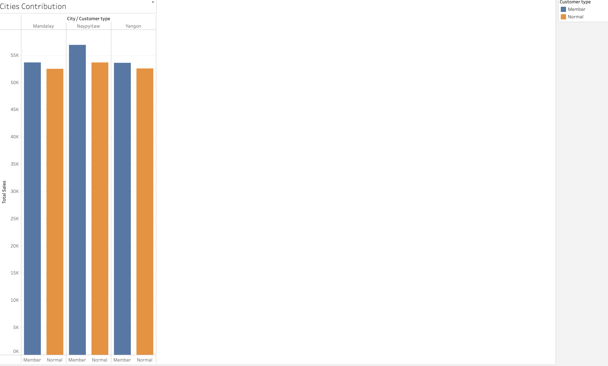

# TECH1M-Supermarket-Project

## You have just been appointed as a Data Analyst for a supermarket outlet. They are looking to leverage data science to start making informed strategic decisions. In particular they are keen to ensure that they use data to find high performing products in their portfolio offering in order to maximise profits and customer satisfaction.

###  1. DISTRIBUTION OF MALE TO FEMALE CUSTOMERS

### 2. AGE DISTRIBUTION OF CUSTOMERS

### 3. MEMBERSHIP COUNT

### 4. METHOD OF PAYMENT

### 5. SALES OF PRODUCTS

### 6. BRANCH SALES PER CUSTOMER PATRONAGE

### 7. CITY WITH MOST SALES / CUSTOMERS CONTRIBUTION BY CITIES

## *ANALYSIS AND RECOMMENDATIONS*

*•Discount on credit card purchases should be encouraged*

*•More adverts on our health and beauty products*

*•There is room for improvement in Mandalay and Yangon city, more investment on advertisement for branches in the two cities*
 
*•The loyalty card(members) made a little more sales in comparison to the normal customers. The total purchases made by members is $164,223 compared to $158,743 purchases made by normal customers, hence I can conclude that there’s a little differences in customers turnover.*

#### LINKS TO TABLEAU DASHBOARD
Click [HERE](https://public.tableau.com/app/profile/michael.willian/viz/SupermarketprojectforTech1/Dashboard1)
